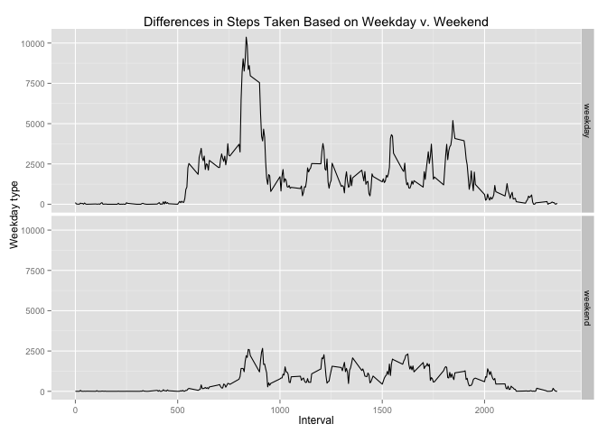

# Reproducible Research: Peer Assessment 1
apyle@github.com  
2015-09-13  

Reproducible Research Project 1 Writeup
=======================================

## Introduction
The first Peer Assessment project in the September, 2015 [Coursera][1] 
[Reproducible Research Class][2] calls for an analysis of data gathered from a 
personal fitness device measuring the wearer's steps in five-minute intervals 
over the period of two months. Details about the assignment can be found in the 
instructor's [github source repository][3].

To begin, we will take care of some housekeeping items to make sure the knitr 
library can properly generate this document. It needs to show all R code 
executed for this analysis. We also want to reference the directory where 
generated plots will be stored.


```r
# make sure we have access to the knitr library for setup and housekeeping
suppressWarnings(library(knitr))

# set knitr default option values, specifically echo, turning on the cache and
# setting its location, and specifying the figure directory
opts_chunk$set(echo = TRUE, cache = TRUE, cache.path = "cache/", fig.path="figure/")
```

## Loading and preprocessing the data

###Load the data downloaded from the GitHub repo

####Step 1. Load the data (i.e. `read.csv()`)

```r
df <- read.csv("activity.csv", head=TRUE)
```

####Step 2. Process/transform the data into a suitable analytical format 

```r
library(dplyr)
by_day <- group_by(df, date)
```

## What is mean total number of steps taken per day?

###Analyze the data as it exists

####Step 1. Calculate the total number of steps taken per day 


```r
day_step_by_int <- summarize(by_day, total_int = sum(steps, na.rm=T))
```

####Step 2. Make a histogram of the total number of steps taken each day


```r
hist(day_step_by_int$total_int, 10, main="Histogram of Frequency of Daily Steps", 
     xlab="Number of Daily Steps", ylab="Frequency")
```

 

```r
my_mean <- mean(day_step_by_int$total_int)
my_median <- median(day_step_by_int$total_int)
```

####Step 3. Calculate and report the mean and median of the total number of steps taken per day

Response: The mean is 9354.2295082 and the median is 10395.

## What is the average daily activity pattern?

###Analyze the data as it exists

####Step 1. Make a time series plot (i.e. `type = "l"`) of the 5-minute interval (x-axis) and the average number of steps taken, averaged across all days (y-axis)


```r
by_interval <- group_by(df, interval)
int_mean <- summarize(by_interval, mean(steps, na.rm=T))
colnames(int_mean) <- c("Interval", "Mean.Steps")
plot(int_mean$Interval, int_mean$Mean.Steps, type="l", 
     main="Average Daily Activity Pattern", xlab="Interval", ylab="Average Steps")
```

 

####Step 2. Which 5-minute interval, on average across all the days in the dataset, contains the maximum number of steps?


```r
max_interval <- int_mean$Interval[which.max(int_mean$Mean.Steps)]
```

Response: The interval with the maximum average steps across the entire day is 835

## Imputing missing values

###Impute missing values and analyze the resulting data

####Step 1. Calculate and report the total number of missing values in the dataset (i.e. the total number of rows with NAs)


```r
missing_values <- sum(is.na(by_day$steps))
```

Response: The total number of missing values in the dataset is 2304

####Step 2. Devise a strategy for filling in all of the missing values in the dataset. 

Response: The relatively unsophisiticated strategy chosen to impute the missing values is to calculate the mean of each 5-minute interval and subsititue that for the `NA` values.


```r
int_mean <- mutate(int_mean, Step.Missing = round(Mean.Steps))
```

####Step 3. Create a new dataset that is equal to the original dataset but with the missing data filled in.


```r
adj_interval <- merge(by_interval, int_mean, by.x = "interval", by.y = "Interval")
adj_interval <- mutate(adj_interval, 
                       imputted = ifelse(is.na(adj_interval$steps), 
                                         adj_interval$Step.Missing, 
                                         adj_interval$steps))
adj_day <- group_by(adj_interval, date)
adj_step_by_day <- summarize(adj_day, adj_steps = sum(imputted))
```

####Step 4a. Make a histogram of the total number of steps taken each day.


```r
hist(adj_step_by_day$adj_steps, 10, main="Histogram of Frequency of Imputed Daily Steps", 
     xlab="Number of Daily Steps", ylab="Frequency")
```

 

####Step 4b. Calculate the mean and median total number of steps taken per day. Do these values differ from the estimates from the first part of the assignment? What is the impact of imputing missing data on the estimates of the total daily number of steps?


```r
original_mean <- mean(day_step_by_int$total_int)
original_median <- median(day_step_by_int$total_int)

imputed_mean <- mean(adj_step_by_day$adj_steps)
imputed_median <- median(adj_step_by_day$adj_steps)

diff_mean = imputed_mean - original_mean
diff_median = imputed_median - original_median
```

Response: The mean for the data with imputed values is 1.0765639\times 10^{4} while the
median is 1.0762\times 10^{4}. This compares to the origial values of 9354.2295082
and 10395 respectively.

By introducing the imputed values the mean increased by 1411.4098361 and the median
increased by 367. By using the imputed values we reduced the number
of days that had very few steps taken and increased the number of days that
represent the mean. The number of days in the historgram above the mean did not
change.

## Are there differences in activity patterns between weekdays and weekends?

###Determine if the day of the week makes a difference in the number of steps in the imputed data

####Step 1. Create a new factor variable in the dataset with two levels – “weekday” and “weekend” indicating whether a given date is a weekday or weekend day.


```r
adj_step_by_interval <- mutate(adj_interval, day_of_week = weekdays(as.Date(date)))
adj_step_by_interval <- mutate(adj_step_by_interval, day_factor = ifelse(day_of_week == "Saturday" | day_of_week == "Sunday", "weekend", "weekday"))
adj_step_by_interval$day_factor <- as.factor(adj_step_by_interval$day_factor)
adj_step_for_graph <- group_by(adj_step_by_interval, day_factor, interval)
adj_step_for_graph <- summarize(adj_step_for_graph, final_steps = sum(imputted))
```

####Step 2. Make a panel plot containing a time series plot (i.e. `type = "l"`) of the 5-minute interval (x-axis) and the average number of steps taken, averaged across all weekday days or weekend days (y-axis). 


```r
library(ggplot2)

g <- ggplot(adj_step_for_graph, aes(interval, final_steps)) + 
        facet_grid(day_factor ~ .) +
        geom_line() +
        xlab("Interval") +
        ylab("Weekday type") +
        ggtitle("Differences in Steps Taken Based on Weekday v. Weekend")

dev.set(2)
```

```
## pdf 
##   2
```

```r
png(file="figure/part5_2.png", width=672)
print(g)
dev.off()
```

```
## pdf 
##   2
```



As shown in the graphs above, the weekday activity starts sooner in the day then on the weekends. There is also more steps taken during the weekdays than on the weekends.

## Conclusion


## Acknowlegements

I improved my original response thanks to the anonymous reviewers of my June 2015 class. I also incorporated ideas from the following classmates in my peer assesment of their assignments: born2rununix, Glabenweek, and karthikr77.  
  
  
[1]: https://www.coursera.org
[2]: https://class.coursera.org/repdata-032
[3]: https://github.com/rdpeng/RepData_PeerAssessment1


